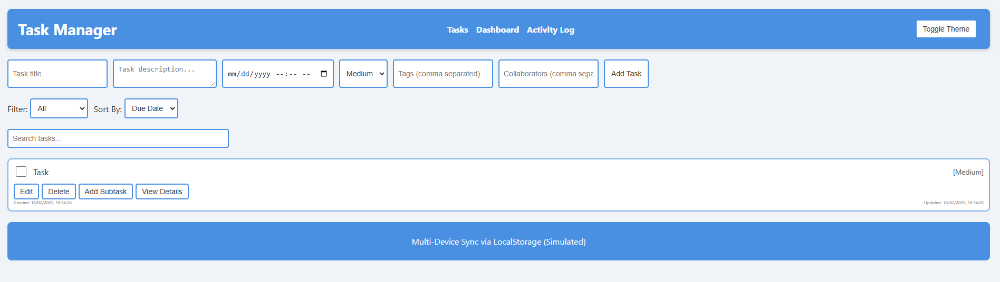
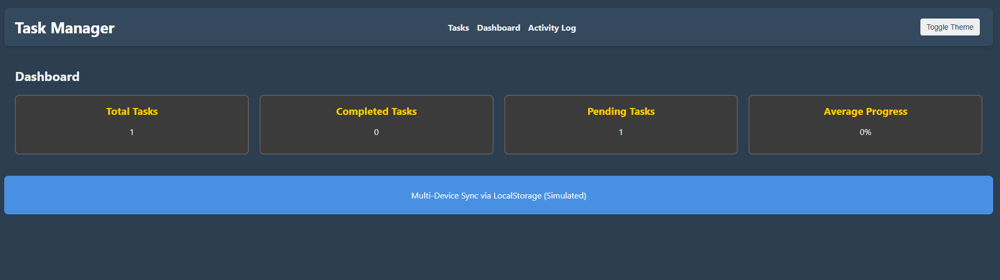
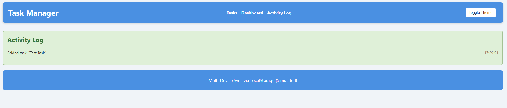

# 📌 Task Manager - A Full-Featured Task Management App

A powerful, user-friendly, and responsive task management application built with React, featuring task tracking, reminders, collaboration, and more!

## 📸 Screenshots

### 📋 Tasks


### 📊 Dashboard


### ⚽ Activity Log


## 🚀 Features

✅ **Task Creation & Editing** - Easily add, modify, and remove tasks.  
✅ **Due Dates & Reminders** - Set deadlines with notifications.  
✅ **Prioritization & Tagging** - Mark tasks as High, Medium, or Low priority.  
✅ **Subtasks & Hierarchies** - Break down tasks into smaller parts.  
✅ **Filtering & Sorting** - Search by status, due date, priority, or category.  
✅ **Collaboration Tools** - Assign tasks to team members.  
✅ **Progress Tracking** - See completion percentages.  
✅ **Activity Log** - Keep track of task history and updates.  
✅ **Dark & Light Mode** - User-friendly UI with theme switching.  

---

## 📦 Installation & Setup

### 1️⃣ Clone the Repository
```bash
git clone https://github.com/yourusername/task-manager.git
cd task-manager
```

### 2️⃣ Install Dependencies
```bash
npm install
```

### 3️⃣ Start the Development Server
```bash
npm start
```

Your app should now be running on **http://localhost:3000/** 🎉

---

## ⚙️ Technologies Used

- **React** - Frontend framework  
- **React Router** - Page navigation  
- **React Hooks** - State & effects management  
- **LocalStorage** - Data persistence  
- **CSS3** - Styling & responsiveness  

---

## 🛠️ Project Structure

```
📂 task-manager
 ┣ 📂 src
 ┃ ┣ 📂 components
 ┃ ┃ ┣ 📜 TaskList.js
 ┃ ┃ ┣ 📜 TaskItem.js
 ┃ ┃ ┣ 📜 TaskForm.js
 ┃ ┃ ┣ 📜 ActivityLog.js
 ┃ ┃ ┣ 📜 Dashboard.js
 ┃ ┃ ┗ 📜 Modal.js
 ┃ ┣ 📜 App.js
 ┃ ┣ 📜 App.css
 ┃ ┗ 📜 index.js
 ┣ 📜 package.json
 ┣ 📜 README.md
 ┗ 📜 .gitignore
```

---

## 📝 Future Enhancements

🔹 **Push Notifications** for deadlines.  
🔹 **User Authentication** for multi-user collaboration.  
🔹 **Drag & Drop Interface** for easy task organization.  
🔹 **Integration with Google Calendar & Slack.**  

